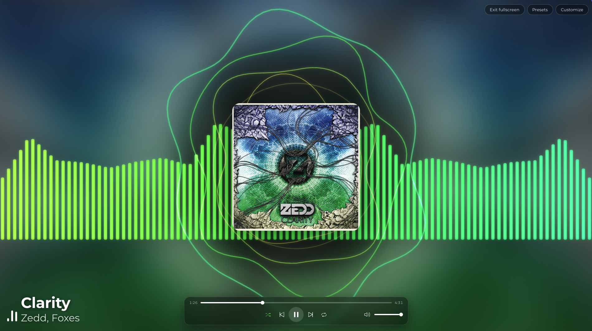

# backmusic

**An audio-reactive backdrop for Spotify — leave it on for a living view of your music, or build your own visualizer.**

Instead of staring at a static Spotify window, backmusic gives you something to look at: a calm,
music-reactive backdrop that moves with whatever's playing. A sidebar icon opens a full-screen
scene driven by your current song — animated sound-wave **rings** (or a **spectrum**), a floating
**centerpiece** (your image or the album art), and optional **particles**, all reacting to the
track's real audio analysis.

It's **deeply customizable**, so you can make it exactly to your liking — from a subtle **ambient
backdrop** you leave running in the background, to a bold, full-on **audio visualizer**. Tune the
colors, wave style, particles, centerpiece and background from the in-app **Customize** panel, and
save your favorite looks as **presets**.



> ⚠️ **Unofficial.** backmusic runs via [Spicetify](https://spicetify.app), which modifies the
> Spotify desktop client and **may be against Spotify's Terms of Service**. Desktop-only. A Spotify
> update can occasionally break it until Spicetify catches up. Use at your own risk.

## Features

- **Backdrop or visualizer** — leave it running for ambiance, or go full-screen for the full show.
- **Audio-reactive** — waves react to the song's real loudness, frequency, and beats (via
  Spicetify's audio analysis).
- **Two wave styles** — concentric **rings**, a mirrored **spectrum** of bars, or **both**, with
  independent size/height, spread, thickness and spacing.
- **Colors your way** — classic rainbow, palette pulled from the **album cover** or your
  **centerpiece**, a single color, plus a saturation slider down to black & white.
- **Centerpiece** — float your own image (with a lasso/refine cutout tool) or the album art.
- **Background & particles** — your image or blurred album art, a color tint, and effects like
  dust, snow, petals, stars, fireflies, music notes and embers.
- **Playback controls** — a fullscreen transport bar (play/pause, skip, seek, volume, shuffle,
  repeat).
- **Presets** — save and switch between named looks (settings + images).

## Install

Requires the **desktop Spotify app** with **[Spicetify](https://spicetify.app/docs/getting-started)**
installed.

> Custom apps aren't one-click in the Marketplace — they need a quick terminal step
> (`spicetify apply`). Pick whichever method you like:

**A) From the Marketplace (then apply):** find **backmusic** under the Marketplace **Apps** tab,
then in a terminal run `spicetify apply` and restart Spotify.

**B) Manual:**
1. Download this repo (green **Code → Download ZIP**, or `git clone`).
2. Copy **`manifest.json`** and **`index.js`** into a new folder named `backmusic` inside your
   Spicetify **CustomApps** directory:
   - macOS / Linux: `~/.config/spicetify/CustomApps/backmusic/`
   - Windows: `%APPDATA%\spicetify\CustomApps\backmusic\`
3. Register and apply:
   ```bash
   spicetify config custom_apps backmusic
   spicetify apply
   ```

**C) From source (for development):**
```bash
npm install
npm run install-local   # builds, copies into Spicetify's CustomApps, runs `spicetify apply`
```

Then open Spotify — the **backmusic** icon is in the left sidebar. Click it, hit **Customize**, and
make it yours. **Fullscreen** takes over the whole window; **Esc** or the toggle returns you.

## Uninstall

```bash
spicetify config custom_apps backmusic-
spicetify apply
```

(Then delete the `CustomApps/backmusic` folder if you like.)

## Build from source

```bash
npm install
npm run build     # bundles to ./index.js (esbuild)
npm run watch     # rebuild on change
```

React/ReactDOM are aliased to Spicetify's own globals, so no second React is bundled; the build
emits a single `index.js` at the repo root next to `manifest.json` (a ready-to-use app folder).

## Credits

Made by [rolandyangg](https://github.com/rolandyangg). Built on [Spicetify](https://spicetify.app);
tempo/loudness/beat data via Spotify's audio analysis. Not affiliated with or endorsed by Spotify.
